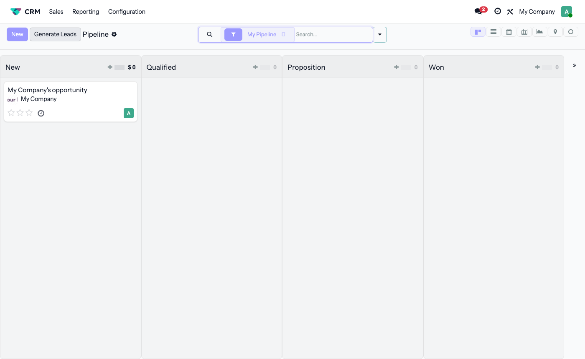
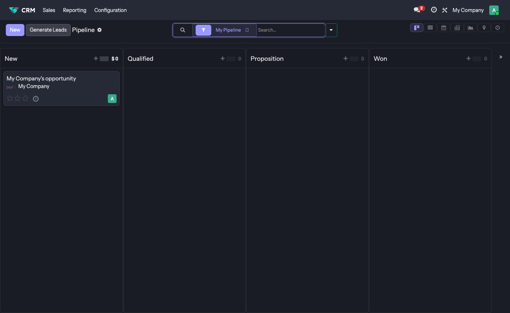

# Pantalytics Style Pro for Odoo 19

A modern, consumer-grade UI theme for Odoo 19 — inspired by the design language of Linear and Vercel. Built and maintained by [Pantalytics](https://pantalytics.com).



---

## Why

Odoo's default UI is functional but dated. This theme replaces it with a clean, minimal interface that feels at home in 2025 — sharp typography, consistent spacing, proper dark mode, and a design token system that makes customisation straightforward.

No third-party CSS framework. No overrides that break on update. Just tokens and targeted SCSS partials injected through Odoo's own asset pipeline.

---

## What's included

| Area | What changed |
|---|---|
| **Typography** | Lexend (headings) + Instrument Sans (body), self-hosted |
| **Colors** | Full `--pan-*` token system for light and dark mode |
| **Dark mode** | Proper dark tokens via `web.assets_web_dark` — uses Odoo's built-in toggle (Enterprise) |
| **Navbar** | Clean white navbar with accent highlights, command palette search bar |
| **Search bar** | Navbar search opens Odoo's command palette (⌘K) — works on both editions |
| **Apps dropdown** | App icons visible in the dropdown menu |
| **Home menu** | Styled app launcher with search bar (Enterprise only) |
| **Kanban** | Styled columns, hover lift on cards, full-height drop zones |
| **List view** | Uppercase column headers, subtle row hover, cleaner borders |
| **Form view** | Card layout with shadow, clean section separators |
| **Control panel** | Aligned search bar, styled filter pills, view switcher |
| **Dropdowns** | Rounded, shadowed panels with proper dark mode support |
| **Modals** | Rounded corners, consistent shadow |
| **Notifications** | Left-border style (no heavy colored backgrounds) |
| **Status bar** | Pill-shaped stage buttons |
| **Tags** | Full pill border-radius, semi-transparent overlays |
| **Login page** | Branded login screen |

---

## Screenshots

### Light mode — CRM Kanban


### Dark mode



---

## Installation

### As Git Submodule (Odoo.sh / self-hosted)

```bash
git submodule add git@github.com:pantalytics/odoo-style-pro.git addons/odoo-style-pro
git commit -m "Add pantalytics theme"
git push
```

In Odoo.sh: **Settings → Submodules → Add submodule**, then add the deploy key from your GitHub repo.

### Manual

```bash
git clone https://github.com/pantalytics/odoo-style-pro /path/to/addons/odoo-style-pro
```

Add to `odoo.conf`:

```ini
addons_path = /path/to/addons/odoo-style-pro,...
```

Install the module:

```bash
odoo -c odoo.conf -i pan_style_pro
```

Or via **Apps** in the Odoo backend — search for `Pantalytics Style Pro`.

On Enterprise, `pan_style_pro_enterprise` auto-installs for home menu and dark mode support.

---

## Module structure

| Module | Depends | auto_install | Purpose |
|---|---|---|---|
| `pan_style_pro` | `web` | No | All base styling, navbar search, app icons |
| `pan_style_pro_enterprise` | `pan_style_pro`, `web_enterprise` | Yes | Home menu, dark mode tokens |

---

## Design tokens

All values are CSS custom properties on `:root`. Override them in your own partial to adapt the theme to any brand.

| Token | Light | Dark |
|---|---|---|
| `--pan-accent` | `#9b99ff` | `#9b99ff` |
| `--pan-accent-hover` | `#7370ff` | `#b3b1ff` |
| `--pan-bg` | `#ffffff` | _(Odoo-controlled)_ |
| `--pan-text` | `#001d21` | `rgba(255,255,255,0.9)` |
| `--pan-text-secondary` | `rgba(0,29,33,0.55)` | `rgba(255,255,255,0.42)` |
| `--pan-border` | `rgba(0,0,0,0.08)` | `rgba(255,255,255,0.09)` |
| Heading font | Lexend 500 | Lexend 500 |
| Body font | Instrument Sans 400–700 | Instrument Sans 400–700 |

---

## Development

SCSS is compiled by Odoo's built-in asset pipeline — no separate build step needed. Run in dev mode for live recompilation:

```bash
odoo -c odoo.conf --dev=assets
```

After changing SCSS, update the module:

```bash
python -m odoo -c odoo.conf --update=pan_style_pro --stop-after-init -d <your_db>
```

See [docs/ARCHITECTURE.md](docs/ARCHITECTURE.md) for the full architecture, token system, and conventions.

---

## Compatibility

| | Status |
|---|---|
| Odoo 19 Community | Tested |
| Odoo 19 Enterprise | Tested |
| Odoo 17/18 | Not supported |
| Light mode | Tested |
| Dark mode | Tested (Enterprise) |

---

## About Pantalytics

[Pantalytics](https://pantalytics.com) builds Odoo modules and integrations for companies that want more from their ERP.

---

## License

LGPL-3.0 — see [LICENSE](LICENSE).
